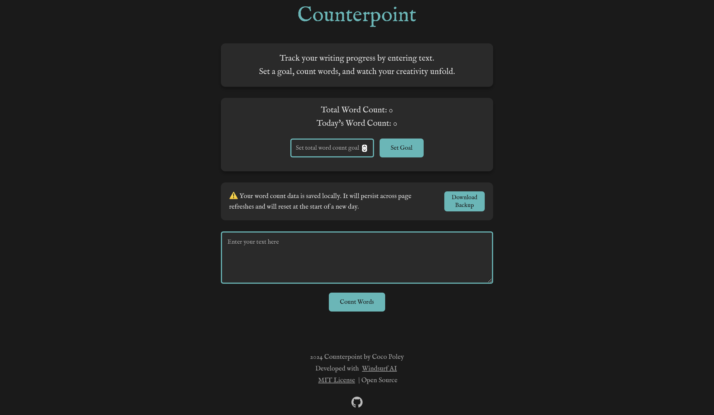

# Counterpoint: A Minimalist Word Counting App 📝

## Overview

Counterpoint is a sleek, dark-themed word counting application designed to help writers track their writing progress with ease and style. Built with Vue.js and TypeScript, it offers a clean, responsive interface for monitoring word count and setting writing goals.



## 🌟 Features

- **Real-time Word Counting**: Track your writing progress instantly
- **Goal Setting**: Set and monitor your writing goals
- **Local Storage**: Save your progress in the browser
- **Backup Functionality**: Download your word count data
- **Responsive Design**: Works on desktop and mobile
- Real-time word count tracking
- Customizable writing goal setting
- Progress bar visualization
- Dark mode design
- Responsive layout
- MIT Open Source License

## 🚀 Technologies

- Vue.js 3
- TypeScript
- date-fns
- Lodash-es
- Vite
- IM Fell English Typography
- Responsive CSS Design

## 📦 Installation

### Prerequisites
- Node.js (v16.0.0+)
- npm (v8.0.0+)

### Steps
1. Clone the repository
```bash
git clone https://github.com/cocopo-codes/counterpoint.git
cd counterpoint/wordcount-app
```

2. Install dependencies
```bash
npm install
```

3. Run the development server
```bash
npm run dev
```

## 🔧 Usage

1. Enter your text in the textarea
2. Click "Count Words" to track your progress
3. Set a word count goal
4. Monitor your daily and total word count

## Running the Application

### Development Mode

Start the development server:
```bash
npm run dev
```

The application will be available at `http://localhost:5173`

### Build for Production

Create a production build:
```bash
npm run build
```

### Preview Production Build

```bash
npm run preview
```

## 🤝 Contributing

We welcome contributions! Please see our [Contributing Guide](CONTRIBUTING.md) and [Code of Conduct](CODE_OF_CONDUCT.md).

## 📄 License

This project is licensed under the MIT License. See the LICENSE file for details.

## 🙌 Acknowledgements

- Developed with [Windsurf AI](https://windsurf.ai)
- Created by [Coco Poley](https://github.com/your-username)
- Built with ❤️ using Vue.js
- Inspired by writers and creators everywhere

## 📞 Support

Open an issue on GitHub for any questions or problems.

## Contact

Coco Poley - [GitHub](https://github.com/your-username)

---

Happy Writing! 📝✨
